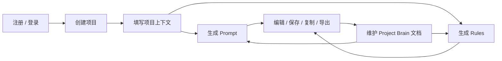
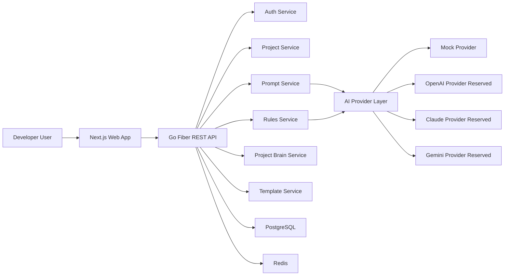
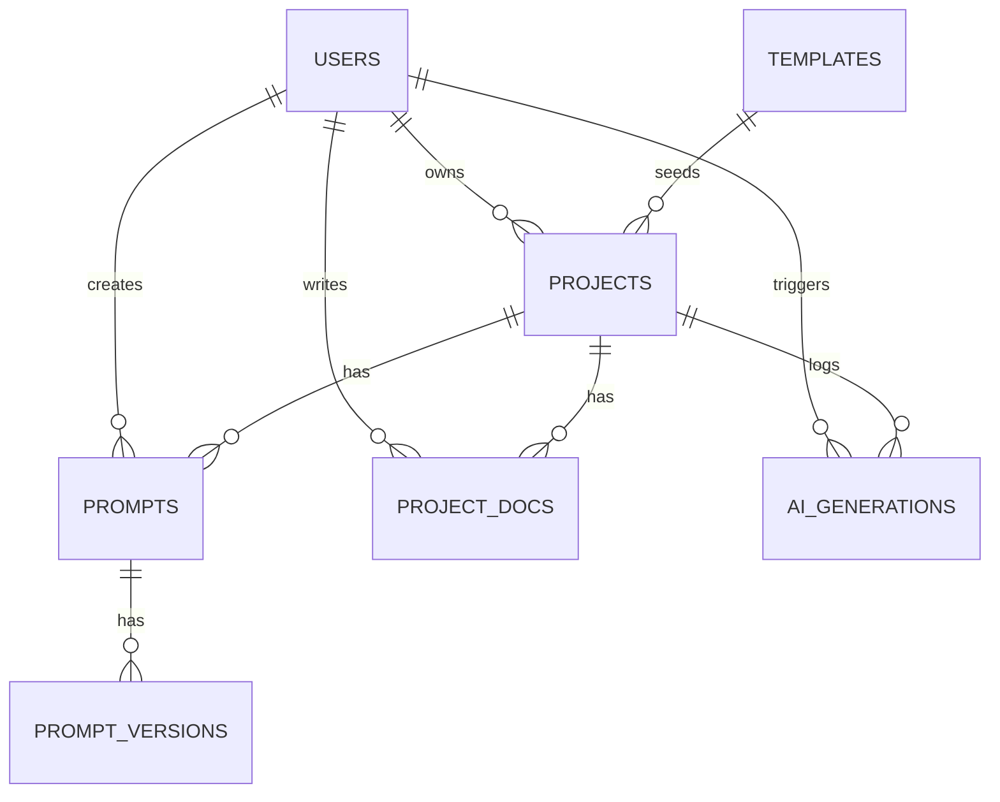
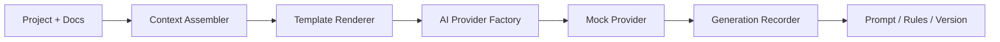

# AI Project OS MVP 架构与开发任务方案

## 1. 产品定位

AI Project OS 是一个面向 AI 编程时代开发者的工作台，用于管理 AI Coding 项目的 Prompt、Rules、项目上下文、开发规范和 Agent 工作流。

它不是普通 Prompt 平台，而是一个逐步演进的 AI Developer Platform。

最终产品方向包括：

- AI Rules Builder
- Prompt Studio
- Project Brain
- Context Manager
- Multi-Agent Workflow
- AI Developer OS

MVP 阶段重点不是一次性实现复杂平台，而是先完成一个可运行、可扩展、能真实产生价值的开发者工作流。

## 2. MVP 核心目标

MVP 版本需要打通以下核心链路：

1. 用户注册和登录。
2. 用户创建 AI Coding 项目。
3. 用户填写项目基础信息和技术栈。
4. 系统根据项目类型和上下文生成 Prompt 与 Rules。
5. 用户可以保存、编辑、复制、导出生成内容。
6. 用户可以维护项目上下文文档。
7. 系统为后续 Project Brain、Context Manager 和 Agent Workflow 预留架构空间。

MVP 的核心价值：

> 帮助开发者为每个 AI Coding 项目沉淀一套可复用、可维护、可持续演进的项目上下文、Prompt 和 AI 编程规则。

## 3. MVP 产品闭环



第一版应优先保证这条主链路稳定、顺畅、可演示。

## 4. 整体技术架构



系统采用前后端分离架构：

- 前端：Next.js App Router + TypeScript + TailwindCSS + shadcn/ui。
- 后端：Go 1.22+ + Fiber + GORM + PostgreSQL + Redis。
- 认证：JWT。
- 配置：Viper。
- 日志：Zap 或 Zerolog。
- AI：Provider 抽象层，MVP 使用 Mock Provider。

## 5. Monorepo 目录结构

```text
ai-project-os/
├── apps/
│   ├── web/
│   └── api/
├── packages/
│   ├── shared/
│   └── prompts/
├── docs/
│   ├── architecture.md
│   ├── api.md
│   ├── database.md
│   └── development.md
├── docker-compose.yml
├── README.md
├── .env.example
└── AI_PROJECT_OS_MVP_ARCHITECTURE.md
```

目录职责：

- `apps/api`：Go 后端服务。
- `apps/web`：Next.js 前端应用。
- `packages/shared`：前后端共享类型、枚举、常量。
- `packages/prompts`：Prompt 模板、Rules 模板、生成规则。
- `docs`：架构、API、数据库、开发说明文档。

## 6. 后端架构设计

后端采用分层架构：

```text
HTTP Request
  ↓
Routes
  ↓
Middleware
  ↓
Handler
  ↓
Service
  ↓
Repository
  ↓
GORM / PostgreSQL
```

### 6.1 后端目录结构

```text
apps/api/
├── cmd/
│   └── server/
│       └── main.go
├── internal/
│   ├── ai/
│   ├── config/
│   ├── database/
│   ├── handlers/
│   ├── middleware/
│   ├── models/
│   ├── repositories/
│   ├── routes/
│   ├── services/
│   ├── utils/
│   └── validators/
├── migrations/
├── go.mod
└── go.sum
```

### 6.2 分层职责

Handler 层：

- 解析 HTTP 请求参数。
- 获取当前登录用户。
- 调用 Service。
- 返回统一 JSON 响应。
- 不写业务逻辑。

Service 层：

- 负责业务流程。
- 负责权限校验。
- 负责生成 Prompt / Rules。
- 负责保存版本。
- 负责调用 AI Provider。

Repository 层：

- 负责数据库读写。
- 不处理业务规则。
- 不直接处理 HTTP 上下文。

Model 层：

- 定义 GORM 模型。
- 管理数据表结构。
- 定义模型关联关系。

AI 层：

- 定义统一 AI Provider 接口。
- 实现 Mock Provider。
- 预留 OpenAI、Claude、Gemini、GLM Provider。

### 6.3 统一响应格式

成功响应：

```json
{
  "success": true,
  "data": {},
  "message": "ok",
  "error": null
}
```

失败响应：

```json
{
  "success": false,
  "data": null,
  "message": "validation failed",
  "error": {
    "code": "INVALID_INPUT",
    "details": {}
  }
}
```

### 6.4 鉴权策略

除以下接口外，所有接口默认需要 JWT 鉴权：

- `POST /api/auth/register`
- `POST /api/auth/login`

鉴权要求：

- JWT Secret 必须来自环境变量。
- 密码必须使用安全 hash。
- 查询项目、Prompt、文档时必须校验 `user_id`。
- 用户不能访问其他用户的数据。

## 7. 前端架构设计

前端采用 Next.js App Router。

### 7.1 前端目录结构

```text
apps/web/
├── app/
├── components/
│   ├── ui/
│   ├── layout/
│   └── editor/
├── features/
│   ├── auth/
│   ├── projects/
│   ├── prompts/
│   ├── rules/
│   ├── brain/
│   └── templates/
├── hooks/
├── lib/
├── public/
├── store/
├── styles/
├── types/
├── package.json
└── next.config.ts
```

### 7.2 前端技术分工

- Next.js App Router：页面路由和布局。
- TypeScript：类型安全。
- TailwindCSS：样式系统。
- shadcn/ui：基础 UI 组件。
- Framer Motion：页面与组件动效。
- Zustand：本地 UI 状态。
- TanStack Query：服务端数据请求和缓存。
- Monaco Editor：Prompt 和 Rules 编辑器。
- React Hook Form + Zod：表单和校验。

### 7.3 前端状态管理

TanStack Query 管理：

- 当前用户信息。
- 项目列表。
- 项目详情。
- Prompt 列表。
- Prompt 版本。
- Project Brain 文档。
- 模板列表。

Zustand 管理：

- Sidebar 展开状态。
- 当前编辑器偏好。
- 当前选中的 Prompt 类型。
- UI 主题状态。
- Command Menu 状态。

## 8. 核心业务模块

## 8.1 用户模块

功能：

- 注册。
- 登录。
- 退出。
- JWT 鉴权。
- 获取用户信息。
- 修改密码，MVP 可保留接口或后续实现。

用户字段：

- `id`
- `email`
- `username`
- `password_hash`
- `avatar`
- `role`
- `created_at`
- `updated_at`

主要接口：

- `POST /api/auth/register`
- `POST /api/auth/login`
- `GET /api/auth/me`

## 8.2 项目模块

用户可以创建和管理多个 AI Coding 项目。

项目字段：

- `id`
- `user_id`
- `name`
- `description`
- `project_type`
- `frontend_stack`
- `backend_stack`
- `database_stack`
- `ai_stack`
- `ui_style`
- `target_user`
- `product_goal`
- `status`
- `created_at`
- `updated_at`

项目类型：

- SaaS
- AI Chat App
- AI Agent App
- Admin Dashboard
- E-commerce
- Blog CMS
- Landing Page
- Mobile App
- Developer Tool
- Internal System

主要接口：

- `GET /api/projects`
- `POST /api/projects`
- `GET /api/projects/:id`
- `PUT /api/projects/:id`
- `DELETE /api/projects/:id`

## 8.3 Prompt 生成模块

Prompt 类型：

- `backend_prompt`
- `frontend_prompt`
- `fullstack_prompt`
- `ui_design_prompt`
- `database_prompt`
- `api_design_prompt`
- `testing_prompt`
- `deployment_prompt`
- `cursor_rules`
- `claude_md`
- `agents_md`

Prompt 字段：

- `id`
- `project_id`
- `user_id`
- `type`
- `title`
- `content`
- `version`
- `created_at`
- `updated_at`

功能：

- 生成 Prompt。
- 保存 Prompt。
- 编辑 Prompt。
- 复制 Prompt。
- 导出 Markdown。
- 查看历史版本。

主要接口：

- `GET /api/projects/:projectId/prompts`
- `POST /api/projects/:projectId/prompts/generate`
- `GET /api/prompts/:id`
- `PUT /api/prompts/:id`
- `DELETE /api/prompts/:id`
- `POST /api/prompts/:id/duplicate`
- `GET /api/prompts/:id/versions`

## 8.4 Rules Builder 模块

支持生成：

- `.cursor/rules/project.mdc`
- `CLAUDE.md`
- `AGENTS.md`
- `frontend-rules.md`
- `backend-rules.md`
- `ui-rules.md`
- `testing-rules.md`

生成内容必须包括：

- 项目目标。
- 技术栈。
- 目录结构规范。
- 命名规范。
- API 规范。
- 数据库规范。
- 错误处理规范。
- 安全规范。
- UI 规范。
- 测试规范。
- 禁止事项。
- Agent 开发流程。

主要接口：

- `POST /api/projects/:projectId/rules/generate`
- `GET /api/projects/:projectId/rules`

## 8.5 Project Brain 模块

MVP 阶段先实现项目上下文文档管理。

文档类型：

- `architecture`
- `api_docs`
- `database_schema`
- `ui_guidelines`
- `coding_standards`
- `product_requirements`
- `changelog`
- `decisions`

字段：

- `id`
- `project_id`
- `user_id`
- `doc_type`
- `title`
- `content`
- `created_at`
- `updated_at`

功能：

- 创建上下文文档。
- 编辑上下文文档。
- 删除上下文文档。
- 根据文档生成 Prompt。
- 根据文档生成 Rules。

主要接口：

- `GET /api/projects/:projectId/docs`
- `POST /api/projects/:projectId/docs`
- `GET /api/docs/:id`
- `PUT /api/docs/:id`
- `DELETE /api/docs/:id`

## 8.6 模板模块

内置项目模板：

- Go + Next.js SaaS
- Python + Vue Admin
- Go + Vue E-commerce
- Next.js AI Chat
- Go + React Dashboard
- AI Agent Platform
- Landing Page Builder

模板字段：

- `id`
- `name`
- `description`
- `project_type`
- `frontend_stack`
- `backend_stack`
- `database_stack`
- `ai_stack`
- `ui_style`
- `default_prompts`
- `default_rules`

主要接口：

- `GET /api/templates`
- `GET /api/templates/:id`

## 8.7 版本管理模块

每次生成或编辑 Prompt 时保存版本。

PromptVersion 字段：

- `id`
- `prompt_id`
- `version`
- `content`
- `change_note`
- `created_at`

功能：

- 查看版本。
- 回滚版本。
- 对比版本，MVP 可先保留接口，不实现复杂 diff。

## 9. 数据库设计

核心表：

- `users`
- `projects`
- `prompts`
- `prompt_versions`
- `project_docs`
- `templates`
- `ai_generations`

实体关系：



`ai_generations` 用于记录每次生成行为。

字段：

- `id`
- `user_id`
- `project_id`
- `generation_type`
- `input_payload`
- `output_content`
- `model_provider`
- `model_name`
- `status`
- `error_message`
- `created_at`

设计要求：

- 所有用户数据必须包含 `user_id`。
- 所有项目相关数据必须包含 `project_id`。
- Prompt 编辑和生成必须写入 `prompt_versions`。
- AI 生成行为必须写入 `ai_generations`。

## 10. AI Provider 设计

AI Provider 接口：

```go
type AIProvider interface {
    Generate(ctx context.Context, req GenerateRequest) (*GenerateResponse, error)
}
```

GenerateRequest：

- `Provider`
- `Model`
- `SystemPrompt`
- `UserPrompt`
- `Temperature`
- `MaxTokens`

GenerateResponse：

- `Content`
- `Usage`
- `Raw`

MVP 实现：

- `MockProvider`

预留实现：

- `OpenAIProvider`
- `ClaudeProvider`
- `GeminiProvider`
- `GLMProvider`

生成流程：



## 11. Prompt 生成规范

生成的 Prompt 必须包含：

- 角色设定。
- 项目背景。
- 技术栈。
- 功能模块。
- 数据库设计要求。
- API 设计要求。
- 前端页面要求。
- 代码规范。
- 安全要求。
- 测试要求。
- 输出要求。
- 禁止事项。

生成目标：

- 专业。
- 工程化。
- 可直接用于 Codex / Claude / Cursor。
- Markdown 结构清晰。
- 可编辑、可复用、可版本化。

## 12. Rules 生成规范

生成的 Rules 必须包含：

- 项目上下文。
- 编码风格。
- 文件结构。
- 命名规范。
- 错误处理。
- 依赖管理。
- Git 提交规范。
- AI Agent 工作方式。
- 不允许擅自修改的内容。
- 每次修改后必须更新的文档。

Rules 文件定位：

- Cursor Rules：约束 Cursor 在项目内的开发行为。
- `CLAUDE.md`：约束 Claude Code 或 Claude 相关 Agent 的工作方式。
- `AGENTS.md`：定义通用 Agent 协作规则。

## 13. 前端页面规划

## 13.1 Landing Page

风格：

- AI Native。
- 高级开发者工具风。
- 深色模式优先。
- 类似 Linear + Vercel + Raycast。
- 简洁、克制、有科技感。

内容：

- Hero 区。
- 产品定位。
- 核心功能。
- 使用流程。
- 适合人群。
- CTA。

## 13.2 登录 / 注册页

功能：

- 邮箱登录。
- 密码登录。
- 表单校验。
- 错误提示。

## 13.3 Dashboard 首页

显示：

- 项目数量。
- 最近项目。
- 最近生成的 Prompt。
- 快捷入口。

## 13.4 项目列表页

功能：

- 查看项目。
- 创建项目。
- 搜索项目。
- 按类型筛选。
- 删除项目。

## 13.5 项目创建页

表单字段：

- 项目名称。
- 项目描述。
- 项目类型。
- 前端技术栈。
- 后端技术栈。
- 数据库。
- AI 模型。
- UI 风格。
- 目标用户。
- 产品目标。

## 13.6 项目详情页

Tabs：

- Overview。
- Prompts。
- Rules。
- Project Brain。
- Settings。

## 13.7 Prompt Studio 页面

功能：

- 选择 Prompt 类型。
- 生成 Prompt。
- Markdown 编辑。
- Monaco Editor。
- 复制。
- 保存。
- 导出。
- 查看版本。

## 13.8 Rules Builder 页面

功能：

- 生成 Cursor Rules。
- 生成 `CLAUDE.md`。
- 生成 `AGENTS.md`。
- 复制。
- 导出。

## 13.9 Project Brain 页面

功能：

- 创建上下文文档。
- 编辑上下文文档。
- 删除上下文文档。
- 根据上下文重新生成 Prompt。
- 根据上下文重新生成 Rules。

## 13.10 设置页

功能：

- 个人信息。
- API Key 设置，MVP 只做 UI。
- 模型偏好设置。

## 14. REST API 设计

认证：

```text
POST /api/auth/register
POST /api/auth/login
GET  /api/auth/me
```

项目：

```text
GET    /api/projects
POST   /api/projects
GET    /api/projects/:id
PUT    /api/projects/:id
DELETE /api/projects/:id
```

Prompt：

```text
GET    /api/projects/:projectId/prompts
POST   /api/projects/:projectId/prompts/generate
GET    /api/prompts/:id
PUT    /api/prompts/:id
DELETE /api/prompts/:id
POST   /api/prompts/:id/duplicate
GET    /api/prompts/:id/versions
```

Rules：

```text
POST /api/projects/:projectId/rules/generate
GET  /api/projects/:projectId/rules
```

Project Brain：

```text
GET    /api/projects/:projectId/docs
POST   /api/projects/:projectId/docs
GET    /api/docs/:id
PUT    /api/docs/:id
DELETE /api/docs/:id
```

Templates：

```text
GET /api/templates
GET /api/templates/:id
```

## 15. 开发阶段拆解

## 15.1 第一阶段：基础设施

目标：

完成项目骨架和基础运行环境。

任务：

- 初始化 Monorepo。
- 初始化 Go Fiber API。
- 初始化 Next.js App Router。
- 配置 TailwindCSS 和 shadcn/ui。
- 配置 GORM。
- 配置 PostgreSQL。
- 配置 Redis。
- 配置 Docker Compose。
- 配置 `.env.example`。
- 编写基础 README。

验收标准：

- 后端可以启动。
- 前端可以启动。
- PostgreSQL 和 Redis 可以通过 Docker 启动。
- 健康检查接口可访问。

## 15.2 第二阶段：用户认证

目标：

完成注册、登录和 JWT 鉴权。

任务：

- 实现 User 模型。
- 实现注册接口。
- 实现登录接口。
- 实现获取当前用户接口。
- 实现密码 hash。
- 实现 JWT 签发与校验。
- 实现 Auth Middleware。
- 实现前端登录页。
- 实现前端注册页。
- 实现 Token 存储和请求拦截。

验收标准：

- 用户可以注册。
- 用户可以登录。
- 登录后可以访问 `/api/auth/me`。
- 未登录不能访问受保护接口。

## 15.3 第三阶段：项目模块

目标：

用户可以管理多个 AI Coding 项目。

任务：

- 实现 Project 模型。
- 实现项目 CRUD API。
- 实现项目权限校验。
- 实现项目列表页。
- 实现项目创建页。
- 实现项目详情页基础框架。
- 实现项目类型枚举。
- 实现搜索和筛选。

验收标准：

- 用户可以创建、查看、编辑、删除自己的项目。
- 用户不能访问其他用户项目。
- 前端项目列表和详情页可用。

## 15.4 第四阶段：Prompt 生成模块

目标：

完成 Prompt Studio MVP。

任务：

- 实现 Prompt 模型。
- 实现 PromptVersion 模型。
- 实现 AIGeneration 模型。
- 实现 AIProvider 接口。
- 实现 MockProvider。
- 实现 Prompt 生成服务。
- 实现 Prompt CRUD。
- 实现 Prompt 版本保存。
- 实现 Prompt Studio 页面。
- 实现复制、保存、导出 Markdown。

验收标准：

- 可以基于项目生成不同类型 Prompt。
- 生成结果是结构化 Markdown。
- 编辑后会保存新版本。
- 可以查看历史版本。

## 15.5 第五阶段：Rules Builder

目标：

完成 AI 编程工具规则文件生成。

任务：

- 实现 Rules 生成服务。
- 实现 Cursor Rules 模板。
- 实现 `CLAUDE.md` 模板。
- 实现 `AGENTS.md` 模板。
- 实现 frontend/backend/ui/testing rules 模板。
- 实现 Rules Builder 页面。
- 实现复制和导出功能。

验收标准：

- 可以生成 Cursor、Claude、Agents 三类核心规则。
- 规则内容包含项目上下文、技术栈、目录规范、命名规范、Agent 工作方式和禁止事项。
- 生成结果可以复制和导出。

## 15.6 第六阶段：Project Brain

目标：

完成项目上下文文档管理。

任务：

- 实现 ProjectDoc 模型。
- 实现文档 CRUD API。
- 实现文档类型枚举。
- 实现 Project Brain 页面。
- 实现文档编辑器。
- 实现基于文档重新生成 Prompt / Rules 的入口。

验收标准：

- 用户可以创建架构文档、API 文档、数据库文档、产品需求等。
- Prompt 生成时可以读取项目上下文文档。
- 文档可以编辑和删除。

## 15.7 第七阶段：模板与 Dashboard

目标：

提升项目初始化效率和首页体验。

任务：

- 实现 Template 模型。
- 实现内置模板种子数据。
- 实现模板列表接口。
- 实现从模板创建项目。
- 实现 Dashboard 统计接口。
- 实现 Dashboard 首页 UI。

验收标准：

- 用户可以从模板创建项目。
- Dashboard 能展示项目数量、最近项目、最近 Prompt。

## 15.8 第八阶段：完善与交付

目标：

产品达到可运行、可演示、可继续迭代状态。

任务：

- 完善错误处理。
- 完善 API 文档。
- 完善数据库文档。
- 完善架构文档。
- 完善开发文档。
- 完善 README 启动说明。
- 增加基础测试。
- 优化 UI 细节。
- 验证 Docker 启动流程。

验收标准：

- 新开发者可以根据 README 启动项目。
- 核心流程可以完整跑通。
- MVP 边界清晰。
- 后续路线清晰。

## 16. 推荐实现优先级

建议按照以下主链路优先开发：

1. 用户注册登录。
2. 创建项目。
3. 生成 Prompt。
4. 编辑保存 Prompt。
5. 生成 Rules。
6. 管理 Project Brain 文档。
7. Dashboard 和模板补齐。

这条主链路最能体现 AI Project OS 的产品价值，也能避免早期陷入复杂 Agent、真实模型接入、团队协作和插件生态等高复杂度功能。

## 17. MVP 不做范围

MVP 暂不实现：

- 真实多 Agent 执行。
- 复杂向量数据库。
- 团队协作。
- 支付。
- 复杂权限系统。
- 浏览器插件。
- IDE 插件。
- 真实模型多供应商完整接入。

但代码结构需要为以上能力预留扩展空间。

## 18. 代码质量要求

后端要求：

- 采用分层架构。
- Handler 不写业务逻辑。
- Service 负责业务。
- Repository 负责数据库。
- 所有 API 返回统一 JSON 格式。
- 所有错误统一处理。
- 除登录注册外，所有接口需要鉴权。
- 所有输入需要校验。
- 密码必须 hash。
- JWT Secret 从环境变量读取。
- 不硬编码敏感信息。

前端要求：

- 请求统一封装。
- 表单必须有校验。
- 重要操作需要 Toast 提示。
- 组件复用清晰。
- 页面支持响应式。
- 深色主题优先。
- 信息密度适中。
- 代码必须可运行。

## 19. 后续路线图

V1：Rules Builder + Prompt Studio。

V2：Project Brain + Context Manager。

V3：代码仓库扫描。

V4：多 Agent Workflow。

V5：团队协作。

V6：浏览器插件 / VSCode 插件 / Cursor 插件。

V7：AI Developer OS。

## 20. 总结

AI Project OS MVP 的重点是先做成一个能真实辅助开发者启动和维护 AI Coding 项目的工作台。

第一版不追求复杂 Agent 和真实模型生态，而是优先沉淀三个核心资产：

- 项目上下文。
- 高质量 Prompt。
- AI 编程规则文件。

只要这三类资产能够围绕项目持续生成、编辑、保存、复用和导出，AI Project OS 就已经具备成为 AI Developer Platform 的基础。
